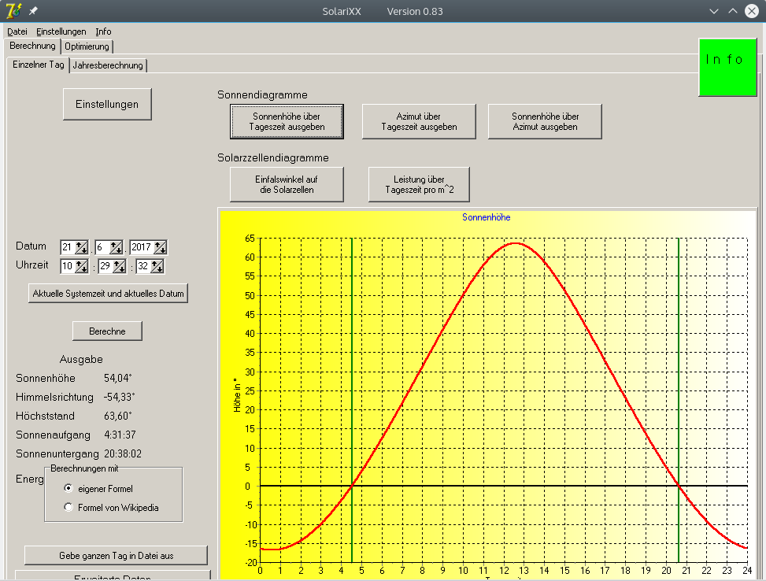
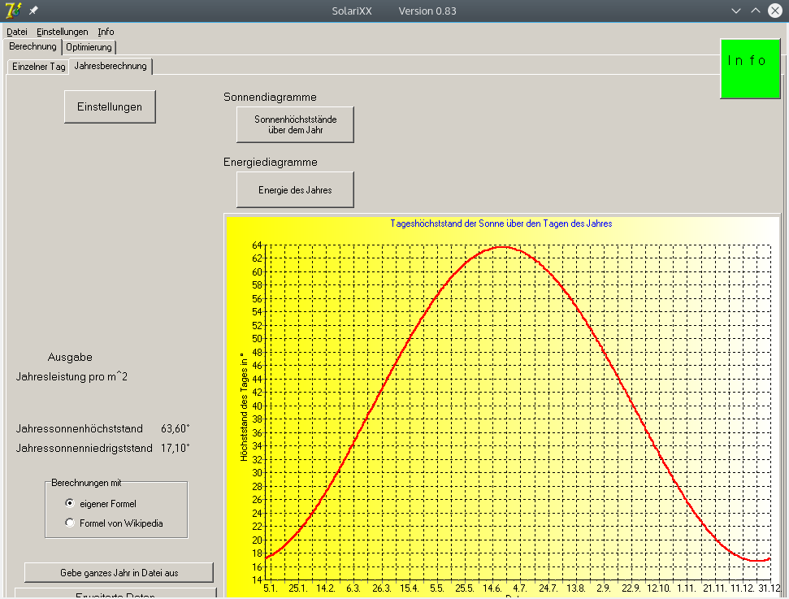

# SolariXX

Based on the position on the earth the program can calculate

* The position of the sun over the day and year
* The angle of the sun relative to the **solar panels** (arbitrary angle) over the day and year
* Optimizing the angle of the solar panel
* Calculating the expected energy captured by the solar panels

## Usage

The binary currently works only in Win XP and in Linux (with Wine). There is an error in Win 10.

 
## Screenshot 

#### Sonnenstand über den Tag 

#### Sonnenhöchststand über das Jahr

